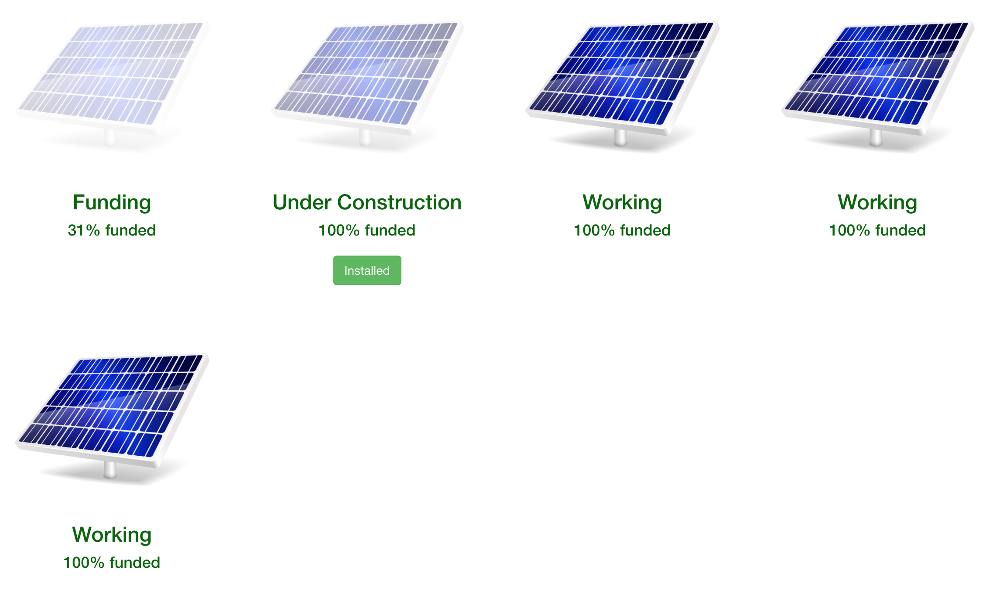
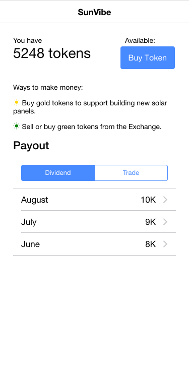
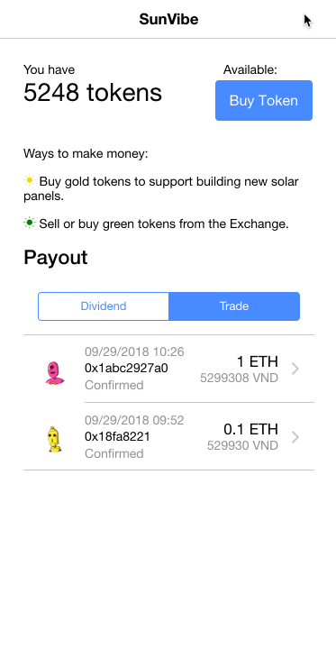

# Hello

Front end implementation to allow a Player to either:

- Buy tokens to contribute to funding Solar Panels
- Buy/Sell tokens on the Marketplace with other players


## Dashboard

Refer to the [Dashboard repo](https://github.com/mcamara/sunvibe-dashboard/)



## Screens

| Home | Purchase  |
|---|---|
|||

## Development

```bash
# Set up
git clone
yarn
ionic serve

# Deployment
ionic build --prod
surge www --domain sunvibe.surge.sh
```

## Customer Calculator